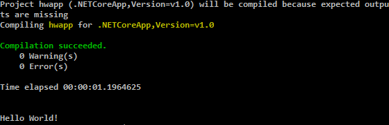

#.NET Core Install for Ubuntu 14.04

`.NET Core`를 **Ubuntu**에 설치하는 과정에 대해서 소개해드리겠습니다.

**Ubuntu** 설치는 필자의 경우는 *Microsoft Azure*에 설치하였습니다.

##1. **.NET Core** 설치 후 *Hello World* 출력해보기

먼저 `.Net Core`를 컴파일하고 실행할 수 있도록 **SDK**를 설치하겠습니다.

공식문서에 설명이 잘 되어 있습니다. (<https://www.microsoft.com/net/core#ubuntu>)
아래 설명대로 해서 잘 안되면 Link의 공식문서에 바뀐 점이 있는지 보시고 따라해주세요.

아래 명령어를 하나씩 입력해주세요.

```
sudo sh -c 'echo "deb [arch=amd64] https://apt-mo.trafficmanager.net/repos/dotnet/ trusty main" > /etc/apt/sources.list.d/dotnetdev.list'

sudo apt-key adv --keyserver apt-mo.trafficmanager.net --recv-keys 417A0893

sudo apt-get update

sudo apt-get install dotnet-dev-1.0.0-preview2-003121
```

이제 `.Net Core SDK` 설치가 끝났습니다.
제대로 설치가 되었는지 기본 예제를 실행해 보겠습니다.

```
mkdir hwapp

cd hwapp

dotnet new

dotnet restore

dotnet run
```

아래와 같이 출력이 나오면 제대로 설치가 된 것입니다.

  

