# Deploy Tensorflow Docker Image to Azure

## 참고사항

똑같은 구성으로 **AWS**에 배포하는 글은 이전에 작성한게 있으니 참고하면 된다.

- [Deploy Tensorflow Docker Image to AWS ECS](https://github.com/DevStarSJ/Study/blob/master/Blog/Python/TensorFlow/ms/ecs.tensorflow.md)
- [Using Tensorflow Predict on AWS Lambda Function](https://github.com/DevStarSJ/Study/blob/master/Blog/Python/TensorFlow/ms/lambda.tensorflow.md)

이 작업을 시작하게 된 이유와 개념적인 구성에 대한 설명은 위 Link의 글들을 참고하길 바란다
즉 학습, 저장, 서비스 를 어떻게 동작시키는 것을 목적으로 하였는지에 대한 설명은 이 글에서는 생략하겠다.

Azure에 구성을 한 것은 이 글 포함 2개의 글이 있다.

- [Deploy Tensorflow Docker Image to Azure](https://github.com/DevStarSJ/Study/blob/master/Blog/Cloud/Azure/AzureContainer.TensorflowDockerImage.md)
- [Using Tensorflow Predict on Azure Function](https://github.com/DevStarSJ/Study/blob/master/Blog/Cloud/Azure/AzureFunction.TensorflowPredict.md)

## 구성

이 글에서 다룰 내용은 위 Link에서 구성한 시스템을 **Microsoft Azure**에 그대로 구현하는 것을 그 목적으로 하였다. 최대한 **AWS**용으로 작성한 코드들을 그대로 쓸려고 노력하였으나 플랫폼 특성상 바뀐점이 있다. 크게 바뀐건 **AWS Lambda**에는 **Python**으로 예측 코드를 작성하였는데,**Azure Function**은 **C#** 으로 작성하였다. 그 이유는 뒤에 따로 설명하겠다.

### 사용한 Azure Service

- [Azure File Storage](https://azure.microsoft.com/services/storage/files) : 학습 데이터, 학습 결과를 저장
- [Azure Container Registry](https://azure.microsoft.com/services/container-registry) : 학습을 진행하는 Tensorflow Docker Image를 Upload할 공간
- [Azure Container Service](https://azure.microsoft.com/services/container-service) : Tensorflow Docker Image를 실행하는 환경
- [Azure Function](https://azure.microsoft.com/services/functions) : 예측 결과 제공 API


## Tensorflow 학습 코드

참고로 이 코드는 [김성훈 교수님의 모두를 위한 딥러닝 강좌](https://www.youtube.com/watch?v=BS6O0zOGX4E&list=PLlMkM4tgfjnLSOjrEJN31gZATbcj_MpUm) 에서 소개된 코드를 이용하였다.

동물의 여러가지 특징들에 대해서 입력받아서 이 동물의 종류가 무엇인가에 대한 학습데이터이다.

<https://archive.ics.uci.edu/ml/machine-learning-databases/zoo> 에서 해당 데이터 내용에 대해서 확인이 가능하다.

여기에는 김성훈 교수님이 미리 만들어 놓은 [data-04-zoo.csv](https://github.com/hunkim/DeepLearningZeroToAll/blob/master/data-04-zoo.csv) 파일을 이용하겠다.

## Azure File Storage 생성

Azure Portal(<https://portal.azure.com>)로 진입한다.

- 우측 상단 `+ New` 클릭
  - `Storage >` 선택
    - `Storage Account blob, file, table, queue` 선택
    - 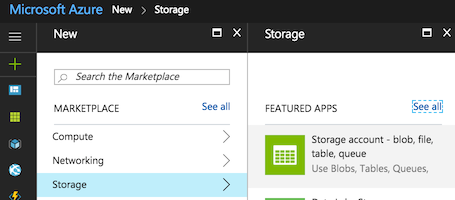
      - `Name`: storage 이름 입력 (ex. tensorflowstorage)
      - `Replication` : 일단 테스트라 잴싼거 `LRS` 선택, 실제 서비스라면 접속 지역 분포에 맞게 적절하게 알맞은 것으로 선택
      - `Resource Group` : 새로 만들던지 이미 있는것을 사용하던지 판단하여 입력
      - `Location` : 기본적으로는 `East US`가 되어있는데, 해당 region과 비용도 같으면서 좀 더 가까운 `Japan West`로 선택했음
      - 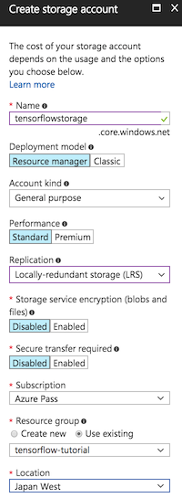
      - `Pin to dashboard`를 선택하면 대쉬보드에 아이콘이 생성되어서 쉽게 진입이 가능하다.
      - `Create`를 눌러서 생성 한 후 다 생성되기를 기다린다.

생성이 끝나면 대쉬보드 화면에 아이콘이 하나 추가된다.

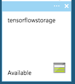

해당 아이콘을 눌러서 들어간다.

`Overview` -> `Files`을 눌러서 들어간 후 File Storage를 하나 생성한다.

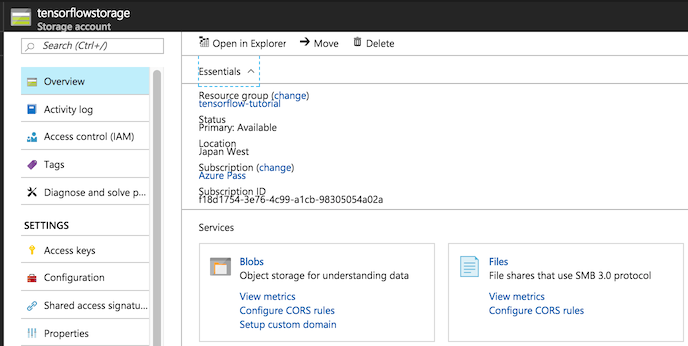

- `+File share` 를 선택
  - Name : 원하는 Share Name을 설정 (ex. tensorflow-savedata)
  - Quota : 테스트니깐 최소값 1GB로 설정

`OK`를 클릭하면 바로 생성 된다.

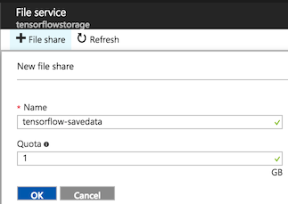

생성된 Share 로 들어가서 일단 수동으로 파일을 1개 Upload 한다.

- `data-04-zoo.csv`를 **Azure File Storage**에 업로드

굳이 지금 할 필요는 없지만 생성한 **Azure Storage** 처음 화면으로 가서 `Account Name`, `Account Key`와 `ConnectionString`을 확인한다.
**Docker** 에서 실행할 Tensorflow 코드 및 **Azure Function**에서 수행할 예측 서비스 코드에서 필요하다.


## Azure Container Service 생성

**Azure Cloud**에서 **Docker Image**를 실행하기 위해서 필요한 서비스다.
실행할 환경으로 생성 한 후에 **Azure Container Registry**에 **Docker Image**를 업로드 한 후 그것을 실행할 용도로 사용된다.

Azure Portal(<https://portal.azure.com>)로 진입한다.

- 우측 상단 `+ New` 클릭
  - `Containers >` 선택
    - `Azure Container Service` 선택
    - 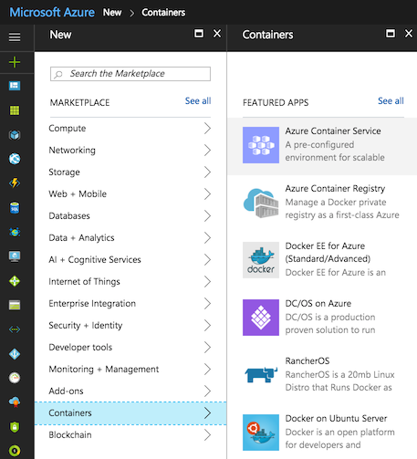
      - 1. Basics
        - `Name`: (ex. acs-tensorflow)
        - `Resource Group` : 비어있는 Recource Group를 요구함. 기존에 생성해 놓은 Recource Group 중 빈 것이 없다면 새로 생성.
        - `Location` : `Japan West`는 아직 지원하지 않는다. `East US`로 일단 생성
        - 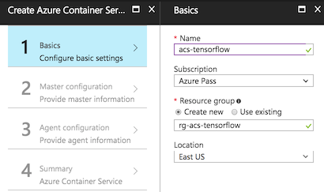
      - 2. Master configuration
        - `Ochestrator` : DC/OS, Kubernetes, Swarm 중 선택이 가능한데, 사실 각 특징에 대해서 잘 모른다. 그냥 `Swarm`으로 선택. (각 방식별 접속 방법이 조금씩 다름)
        - `DNS name prefix` : 접속시 필요한 url에 추가되는 값이다. Portal에 url 확인이 가능하니 신경쓰지 않아도 된다.
        - `User name` : 원하는 사용자명을 입력
        - `SSH public key` : 오른쪽 `i` 아이콘을 누르면 Windows, Linux/Mac 에서 ssh 생성하는 방법이 나온다. 그대로 수행한 후 public key 값을 입력하면 된다. 
        - 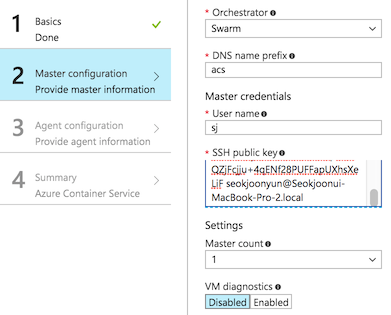
      - 3. Agent configuration
        - 실행할 환경을 설정한다. 일단 테스트라 가장 싼것으로 찾아보려 했으나... ;;;
        - 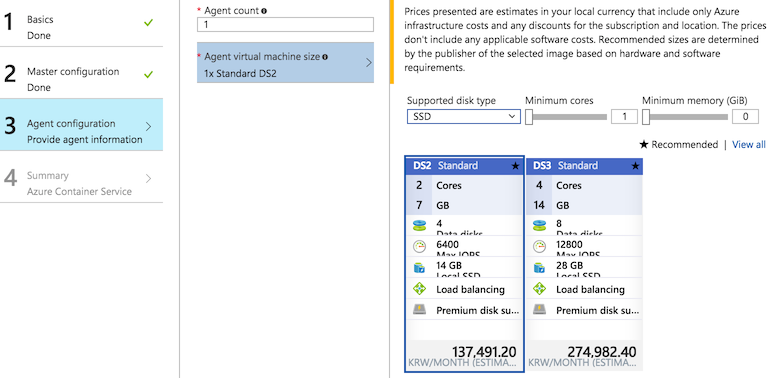
      - Summary 창을 보고 확인을 누르면 Dashboard에 생성된다. 시간이 좀 걸리니 기다려야 한다.

## Azure Container Registry 생성

Azure Portal(<https://portal.azure.com>)로 진입한다.

- 우측 상단 `+ New` 클릭
  - `Containers >` 선택
    - `Azure Container Register` 선택
      - `Registry name Name`: (ex. acrtensorflow)
        - `Resource Group` : 이미 사용중인 Recource Group을 선택해도 됨.
        - `Location` : `East US`로 일단 생성
        - 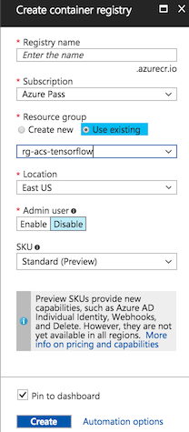

거의 바로 만들어 진다.

해당 메뉴로 들어가서 `Access keys`를 누른후  `Admin user`를 `Enable`로 선택하면 접속에 필요한 **Username**과 **password** 확인이 가능하다.

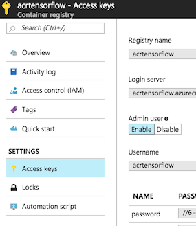

일단 여기까지 진행한 후 Docker Image를 생성하는 단계로 넘어가겠다.

## Tensorflow 실행 코드 작성

작업할 폴더를 하나 생성하여 그 안에 아래 작업들을 진행한다.

- 코드를 실행할 위치에 `saver`라는 폴더 생성 (`mkdir saver`)  

#### run.py

**Python 3.6**으로 작성되었으며 `Azure File Storage`에서 학습데이터를 다운받아서 **Tensorflow**로 학습 후 그 결과를 **Tensorflow Saver File**, **JSON 파일** 형식으로 `Azure File Storage`에 다시 업로드하는 작업을 수행하는 코드이다.

```Python
import tensorflow as tf
import numpy as np
import datetime
import os
import json
from azure.storage.file import FileService

SAVER = "saver"
SAVER_FOLDER = "./" + SAVER
TRAIN_DATA = "data-04-zoo.csv"
RESULT_FILE = 'result.json'
FILE_SHARE = 'tensorflow-savedata'

for file in os.listdir(SAVER_FOLDER):
    os.remove(SAVER_FOLDER + "/" + file);

file_service = FileService(account_name='[NAME]', account_key='[KEY]')

file_service.get_file_to_path(FILE_SHARE, None, TRAIN_DATA, TRAIN_DATA)
file_service.create_directory(FILE_SHARE, SAVER);

xy = np.loadtxt(TRAIN_DATA, delimiter=',', dtype=np.float32)
x_data = xy[:,0:-1]
y_data = xy[:,[-1]]
nb_classes = 7

X = tf.placeholder(tf.float32, [None, 16])
Y = tf.placeholder(tf.int32, [None, 1])

Y_one_hot = tf.one_hot(Y, nb_classes)
Y_one_hot = tf.reshape(Y_one_hot, [-1, nb_classes])

W = tf.Variable(tf.random_normal([16, nb_classes]), name='weight')
b = tf.Variable(tf.random_normal([nb_classes]), name='bias')

logits = tf.matmul(X,W) + b
hypothesis = tf.nn.softmax(logits)
cost_i = tf.nn.softmax_cross_entropy_with_logits(logits=logits, labels=Y_one_hot)
cost = tf.reduce_mean(cost_i)
optimizer = tf.train.GradientDescentOptimizer(learning_rate=0.1).minimize(cost)

prediction = tf.argmax(hypothesis, 1)
correct_prediction = tf.equal(prediction, tf.argmax(Y_one_hot, 1))
accuracy = tf.reduce_mean(tf.cast(correct_prediction, tf.float32))

saver = tf.train.Saver()

with tf.Session() as sess:
    sess.run(tf.global_variables_initializer())
    
    for step in range(2001):
        sess.run(optimizer, feed_dict={X: x_data, Y: y_data})
        if step % 100 == 0:
            print(step, sess.run([cost, accuracy], feed_dict={X: x_data, Y: y_data}))

    saver.save(sess,"./saver/save.{}.ckpt".format(datetime.datetime.now().strftime("%Y-%m-%d_%H%M%S")))
    saver.save(sess,"./saver/save.last.ckpt")

    pred = sess.run(prediction, feed_dict={X: x_data})

    pw, pb = sess.run([W, b])
    result = {'W': pw.tolist(), 'b': pb.tolist()}
    print(result)

    with open(RESULT_FILE, 'w') as outfile:
        json.dump(result, outfile)

    for p, y in zip(pred, y_data.flatten()):
        print("[{}] Prediction: {} True Y: {}".format(p == int(y), p, int(y)))

file_service.create_file_from_path(FILE_SHARE, None, RESULT_FILE, RESULT_FILE)

for file in os.listdir(SAVER_FOLDER):
    print(file)
    file_service.create_file_from_path(FILE_SHARE, "saver", file, SAVER_FOLDER + "/" + file)
``` 

PC에 tensorflow ,numpy, azure가 설치된 상태라면 바로 실행해볼수도 있다.

```
pip install tensorflow numpy azure

python run.py
```

## Docker 이미지 생성

Docker 설치방법에 대해서는 따로 설명하지 않겠다.

위에서 작업한 폴더에 `Dokerfile`을 생성한다.

#### Dockerfile
```Dockerfile
FROM python:3

RUN pip install tensorflow azure numpy

WORKDIR /usr/src/app

COPY . .

CMD [ "python", "./run.py" ]
```

```shell
docker build -t tensorflow-azure .
```
커맨드를 입력하면 Docker Image가 생성된다. 시간이 많이 걸리는 작업이니 미리 실행해 두고 다음단계로 진행하는 것을 추천한다.

## Azure Container Registry에 Docker Image 업로드

생성해둔 **Azure Container Registry**에 들어가서 `Quick Start` 버튼을 누르면 업로드에 필요한 명령어 들이 나온다.


- 3번 항목의 Login을 수행한다.
  - `docker login acrtensorflow.azurecr.io`
    - `Access keys`에서 확인한 **Username**과 **password**로 접속
- 4번 항목을 참고하여 좀 전에 만들어 놓은 **Docker Image**를 **Tag** 하고 **Push** 하는 과정을 수행한다.
  - `docker tag tensorflow-azure acrtensorflow.azurecr.io/tensorflow-azure`
  - `docker push acrtensorflow.azurecr.io/tensorflow-azure`

이제 **Docker Image**가 **Azure Container Registry** 업로딩 되었다.

5번 항목에 있는 **pull** 명령어는 **Docker Container Servie**에 접속한 후 실행하면 된다.

```
docker pull acrtensorflow.azurecr.io/tensorflow-azure

docker run acrtensorflow.azurecr.io/tensorflow-azure
```

## Azure Container Service에서 Docker Image 실행

<https://docs.microsoft.com/ko-kr/azure/container-service/container-service-connect>

위 Link를 참고해서 생성한 **Azure Container Service**의 설정에 맞게끔 접속하면 된다.

참고로 위에 설정한 값으로 접속을 하려면 아래 명령어로 접속이 가능하다. (ssh 파일 위치를 `~/.ssh` 에 생성했다고 가정)

```
ssh -fNL 2375:localhost:2375 -p 2200 sj@acsmgmt.eastus.cloudapp.azure.com -i ~/.ssh/sj

export DOCKER_HOST=:2375
```

이제 `docker images`를 입력하면 내 PC 의 목록이 아닌 **Azure Container Service** 상에서의 목록이 출력된다.

아직 한번도 **Azure Container Service**에서 **Docker Image**를 가져오지 않았다면 일단 로그인하여서 가져와야 한다.

- `docker login acrtensorflow.azurecr.io`
  - `Access keys`에서 확인한 **Username**과 **password**로 접속
- `docker pull acrtensorflow.azurecr.io/tensorflow-azure`

이제 실행을 해보자.

```
docker run acrtensorflow.azurecr.io/tensorflow-azure
```

이제 내 PC가 아니라 **Azure Cloud** 상에서 실행이 되는 것이다.

실행 후 **Azure File Storage** 에 파일들이 정상적으로 생성되었는지 확인해보면 된다.


### 다음글 : Azure Function으로 예측 서비스 제공하기

[Using Tensorflow Predict on Azure Function](https://github.com/DevStarSJ/Study/blob/master/Blog/Cloud/Azure/AzureFunction.TensorflowPredict.md)