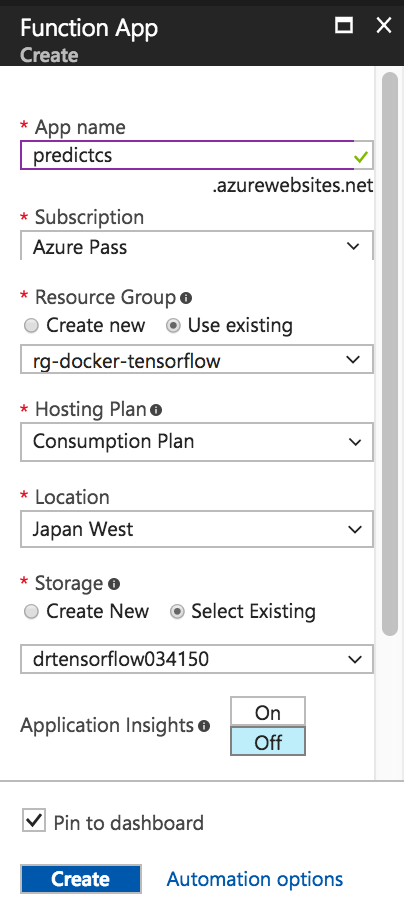
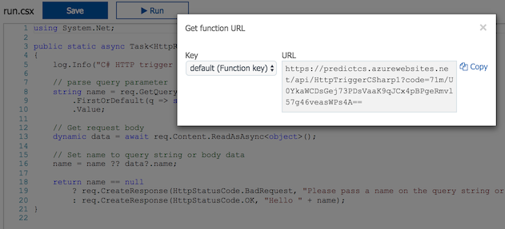
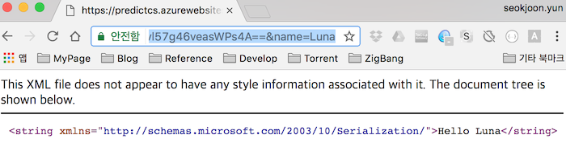
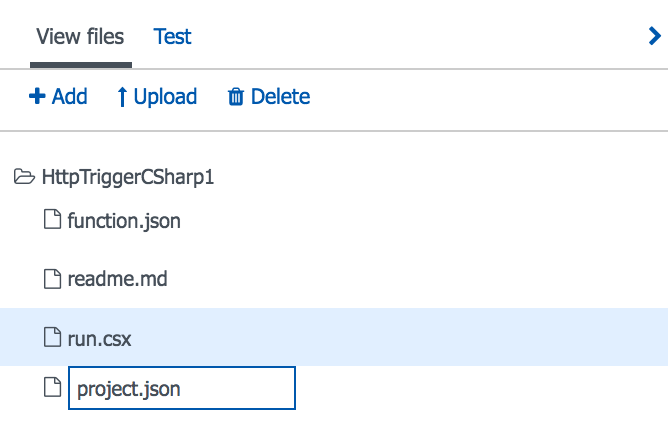
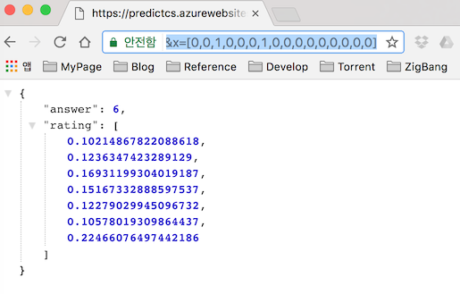

# Using Tensorflow Predict on Azure Function

## 참고사항

똑같은 구성으로 **AWS**에 배포하는 글은 이전에 작성한게 있으니 참고하면 된다.

- [Deploy Tensorflow Docker Image to AWS ECS](https://github.com/DevStarSJ/Study/blob/master/Blog/Python/TensorFlow/ms/ecs.tensorflow.md)
- [Using Tensorflow Predict on AWS Lambda Function](https://github.com/DevStarSJ/Study/blob/master/Blog/Python/TensorFlow/ms/lambda.tensorflow.md)

이 작업을 시작하게 된 이유와 개념적인 구성에 대한 설명은 위 Link의 글들을 참고하길 바란다
즉 학습, 저장, 서비스 를 어떻게 동작시키는 것을 목적으로 하였는지에 대한 설명은 이 글에서는 생략하겠다.

Azure에 구성을 한 것은 이 글 포함 2개의 글이 있다.

- [Deploy Tensorflow Docker Image to Azure](https://github.com/DevStarSJ/Study/blob/master/Blog/Cloud/Azure/AzureContainer.TensorflowDockerImage.md)
- [Using Tensorflow Predict on Azure Function](https://github.com/DevStarSJ/Study/blob/master/Blog/Cloud/Azure/AzureFunction.TensorflowPredict.md)

## 왜 이런 생각을 ???

앞서 **Azure Container Service**에서 **Tensorflow**를 이용하여 학습을 진행하여 그 결과를 **Azure File Storage**에 저장하는 방법에 대해서 글을 적었다.

[Deploy Tensorflow Docker Image to Azure](https://github.com/DevStarSJ/Study/blob/master/Blog/Cloud/Azure/AzureContainer.TensorflowDockerImage.md)

학습 결과를 **Azure File Storage**에 남긴 이유는 크게 2가지였다.

- 하나는 다음에 학습을 진행할때 해당 값을 이용하여 계속해서 학습을 진행 할 경우를 대비하자는 것이고,
- 다른 하나는 학습 결과 데이터를 이용해서 예측하는 서비스를 제공하는데 사용하려는 목적이다.

## Azure Function에 Tensorflow 배포 ?

먼저 **Tensorflow**를 **AWS Lambda**에 배포하는것은 안된다고 **AWS Lambda** 관련 글에 남긴적이 있다.
그럼 **Azure Function**에는 가능할까 ?

아직 끝까지 가보지는 않았지만, 가능하리라 판단된다. 하지만 쉽지 않을 것이다.

왜냐면 **Azure Function**의 경우에는 실행 환경을 커스터마이징하는게 가능하다. 기본적으로 제공해주는 것과 다른 버전의 **Python**설치도 가능하다. 하지만 실제로 테스트해보니 엄청 손이 많이 가는 작업이다. **Python 3.6**이 수행되도록 설치를 하였으나 **pip**가 동작하지 않았다. 아마 이것또한 따로 설치해 줘야 할것이다. 이런 식으로 하나하나 설치하다보면 언젠가는 **tensorflow** 실행까지 가능하도록 구축이 될 것이다. 만약 이게 업무였다면 끝까지 파고들어서 설치까지 진행했겠지만, 단순 테스트용으로 그렇게까지 하고 싶지는 않아서 그냥 더 이상 진행하지 않았다.

더 이상 진행하지 않은 이유가 하나 더 있는데, 아직 **Azure Function**에서 **Python**으로 작업하는게 아직까진 자연스럽지 않다. **C#** 이나 **Node.JS**의 경우에는 최초 실행되는 코드가 함수로 감싸져 있고, Http로 전달한 querystirng, body 정보 같은게 해당 함수의 인자로 전달되는데, **Python**의 경우는 최초 실행되는 코드가 따로 함수로 감싸져 있지 않고, 그냥 파일의 처음부터 실행되며, 요청한 값들을 `os.environ`에서 직접 가져와야 한다. 아직까지 정식으로 **Python**을 지원한다기보다는 그냥 Preview 정도의 느낌이다.

그래서 가장 `Azure`에서 자연스럽게 동작할 **C#**으로 작성을 하였다. 파일 형식이 `.cs`가 아니라 `.csx`인데, 이 부분도 솔직히 조금 불편했다. 그래서 결국에는 **ConsoleApplication Project**를 하나 생성하여서 거기서 작업을 다 한뒤에 `.csx`파일로 옮겼다.

먼저 **Azure Function** 을 생성해 보겠다.

## Azure Function 생성

- 우측 상단 `+ New` 클릭
  - `Web + Mobile >` 범주에 속하기는 하나 많이 사용하지 않는지 기본 목록에는 나오지 않고, `See all`을 눌러야지만 나온다.
  - 그냥 검색으로 `Function`을 입력해서 선택한 후 `Create`를 누르자.
    - `App Name` : (ex. predictcs)
    - `Resource Group` : 그냥 기존에 생성해 놓은것으로 같이 쓰도록 설정
    - `Location` : `Japan West` 그나마 거리 가까운것 중에 가장 저렴한 것으로 설정
    - `Storage` : 그냥 기존에 생성해 놓은것으로 같이 쓰도록 설정
    - `Create`를 눌루서 생성
    - 

그럼 대쉬보드 상에서 생성되는 것을 볼 수 있다. 생성이 끝나면 바로 설정 창으로 이동된다.

- `Functions +`에서 `+`를 눌러서 새로 생성
  - `Webhook + API`, `CSharp`이 default로 선택되어 있음.
  - 그냥 `Create this function`을 눌러서 생성

그럼 자동으로 기본적인 `Hello World`같은 코드가 작성되어 있다.

우측 상단의 `Get Function URL`을 눌러서 호출 가능한 주소를 확인하자.



해당 URL을 복사해서 Browser 주소창에 붙인후 뒤에 `&Name=Luna`를 추가해서 호출하면 결과 확인이 가능하다.



이제 코드를 작성해 보자.

## C# 으로 작성된 Predict 제공 코드

참고로 아래 코드는 [Using Tensorflow Predict on AWS Lambda Function](https://github.com/DevStarSJ/Study/blob/master/Blog/Python/TensorFlow/ms/lambda.tensorflow.md)에서 작성한 **Python**코드를 **C#** 으로 옮긴 코드이다.
물론 **AWS S3**에서 파일을 다운로드 받는 것을 **Azure File Storage**에서 받는 것으로 수정하였다.

**Azure Function**의 경우 **C#**의 **nuget**으로 제공되는 패키지들의 설치가 가능하다는 점이 좋았다.

먼저 사용한 **nuget** 들을 `project.json`파일에 정의해야 한다. 해당 파일이 생성되어 있지 않다면 만들어야 한다.



### project.json
```JSON
{
  "frameworks": {
    "net46":{
		"dependencies": {
			"MathNet.Numerics": "3.20.0",
			"Microsoft.Azure.KeyVault.Core": "2.0.4",
			"Microsoft.Data.Edm":"5.8.2",
			"Microsoft.Data.OData":"5.8.2",
			"Microsoft.Data.Services.Client":"5.8.2",
			"Microsoft.WindowsAzure.ConfigurationManager":"3.2.3",
			"Newtonsoft.Json":"10.0.3",
			"System.ComponentModel.EventBasedAsync":"4.3.0",
			"System.Dynamic.Runtime":"4.3.0",
			"System.Linq.Queryable":"4.3.0",
			"System.Net.Requests":"4.3.0",
			"System.Spatial":"5.8.2",
			"WindowsAzure.Storage":"8.2.0"
		}
    }
  }
}
```

### run.csx
```CSharp
using System;
using System.Net;
using System.Collections.Generic;
using System.IO;
using System.Linq;
using System.Text;
using MathNet.Numerics.LinearAlgebra;
using MathNet.Numerics.LinearAlgebra.Double;
using Microsoft.Azure;
using Microsoft.WindowsAzure.Storage;
using Microsoft.WindowsAzure.Storage.File;
using Newtonsoft.Json;

public static async Task<object> Run(HttpRequestMessage req, TraceWriter log)
{
	log.Info($"C# HTTP trigger function processed a request. RequestUri={req.RequestUri}");

	string xStr = req.GetQueryNameValuePairs().FirstOrDefault(q => q.Key == "x").Value;
	double[] x1 = JsonConvert.DeserializeObject<double[]>(xStr);
	var x2 = Convert2D(x1);

	PredictModel model = await GetPredictModel(ConnectionString, ShareName, ResultFile);

	var W = DenseMatrix.OfArray(model.W);
	var X = DenseMatrix.OfArray(x2);
	var H = ArrayAdd(X.Multiply(W).Row(0).AsArray(), model.b);

	var sigmoid = H.Select(Sigmoid);

	var response = new ResponseModel();
	response.rating = Softmax(sigmoid).ToArray();
	response.answer = Argmax(response.rating);


	var jsonResponse = JsonConvert.SerializeObject(response);

	return new HttpResponseMessage(HttpStatusCode.OK)
	{
		Content = new StringContent(jsonResponse, Encoding.UTF8, "application/json")
	};
}

const string ConnectionString = "DefaultEndpointsProtocol=https;AccountName=[NAME];AccountKey=[KEY];EndpointSuffix=[...]";
const string ShareName = "tensorflow-savedata";
const string ResultFile = "result.json";

public class PredictModel
{
	public double[,] W { get; set; }
	public double[] b { get; set; }
}

public class ResponseModel
{
	public int answer { get; set; }
	public double[] rating { get; set; }
}

static IEnumerable<double> Softmax(IEnumerable<double> M, double t = 1.0)
{
	var E = M.Select(x => Math.Exp(x / t));
	var total = E.Sum();
	return E.Select(x => x / total);
}

static double Sigmoid(double z)
{
	return 1 / (1 + Math.Pow(Math.E, -1.0 * z));
}

static int Argmax(IEnumerable<double> M)
{
	var max_num = -1.0;
	var max_index = -1;
	for (int i = 0; i < M.Count(); i++)
	{
		var y = M.ElementAt(i);
		if (y > max_num)
		{
			max_num = y;
			max_index = i;
		}
	}

	return max_index;
}

static double[,] Convert2D(double[] d1)
{
	var d2 = new double[1, d1.Length];
	for (int i = 0; i < d1.Length; i++)
	{
		d2[0, i] = d1[i];
	}
	return d2;
}

static double[] ArrayAdd(double[] A, double[] B)
{
	return A.Select((a, i) => a + B[i]).ToArray();
}

static async Task<PredictModel> GetPredictModel(string connectionString, string shareName, string fileName)
{
	CloudStorageAccount storageAccount = CreateStorageAccountFromConnectionString(connectionString);
	CloudFileClient fileClient = storageAccount.CreateCloudFileClient();
	CloudFileShare share = fileClient.GetShareReference(shareName);

	try
	{
		await share.CreateIfNotExistsAsync();
	}
	catch (Exception)
	{
		throw;
	}

	CloudFileDirectory root = share.GetRootDirectoryReference();
	CloudFile file = root.GetFileReference(fileName);

	byte[] buffer = new byte[65535];
	await file.DownloadToByteArrayAsync(buffer, 0);

	var strJson = System.Text.Encoding.Default.GetString(buffer);
	return JsonConvert.DeserializeObject<PredictModel>(strJson);
}

private static CloudStorageAccount CreateStorageAccountFromConnectionString(string storageConnectionString)
{
	try
	{
		return CloudStorageAccount.Parse(storageConnectionString);
	}
	catch (Exception e)
	{
		throw;
	}
}
```

`ConnectionString`는 해당 `Azure Storage`에 가서 `Access Key`를 누르면 확인이 가능하다. 그것을 입력해준다.

그런 다음 호출 URL을 복사하고 그 뒤에다가 `&x=[0,0,1,0,0,0,1,0,0,0,0,0,0,0,0,0]`값을 추가한 뒤 브라우저로 호출을 해보자.



제대로 응답이 오는게 확인이 가능하다.


## Tensorflow 학습 코드

참고로 이 코드는 [김성훈 교수님의 모두를 위한 딥러닝 강좌](https://www.youtube.com/watch?v=BS6O0zOGX4E&list=PLlMkM4tgfjnLSOjrEJN31gZATbcj_MpUm) 에서 소개된 코드를 이용하였다.

동물의 여러가지 특징들에 대해서 입력받아서 이 동물의 종류가 무엇인가에 대한 학습데이터이다.

<https://archive.ics.uci.edu/ml/machine-learning-databases/zoo> 에서 해당 데이터 내용에 대해서 확인이 가능하다.

여기에는 김성훈 교수님이 미리 만들어 놓은 [data-04-zoo.csv](https://github.com/hunkim/DeepLearningZeroToAll/blob/master/data-04-zoo.csv) 파일을 이용하겠다.

