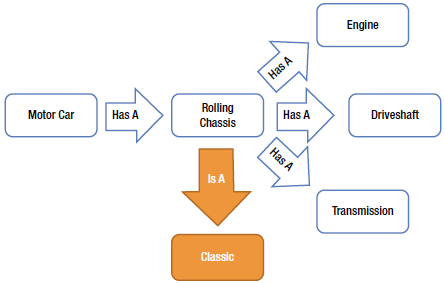

# Chapter 3 Object Orientation in TypeScript

소프트웨어를 디자인하는 방법 2가지가 있습니다.
하나는 간단하게 만들어서 명백하게 결함을 없게하는 것이고,
다른 방법은 복잡하게 만들어서 병백한 결함을 없게하는 것입니다.
전자가 조금 더 어렵습니다. 그것은 마치 복잡한 자연의 섭리와 같은 기술, 헌신, 통찰력, 영감 등을 요구합니다.
- Tony Hoare

객체지향 프로그래밍은 현실 세계와 유사하게 데이터와 관련된 행위를 코드로 표현합니다.
이것을 보통 property와 method를 포함하는 class로 표현하고 있으며,
해당 class로 부터 생성한 객체를 object라고 부릅니다.
....(이하 생략)

## Obejct Orientation in TypeScript

타입스크립트는 다양한 OOP 개념들을 지원하고 있습니다.

- Classes
- Instance of classes
- Methods
- Inheritance
- Open recursion
- Encapsulation
- Delegation
- Polumotphism

Calsses, Instace of classes, Methods, Ingeritacne는 Chapter.01에서 이미 살펴보았습니다.

## Open Recursion

연린 재귀(Open Recursion)은 재귀의 조합과 늦은 바인딩입니다.
클래스 내에서 메서드가 자기자신을 호출한 경우, 서브클래스에 정의된 함수를 호출 할 수도 있습니다.
*List 3-1*은 디렉토리의 내용을 읽는 클레스입니다.
`FileReader` 클래스는 입력받은 경로에서 내용들을 읽습니다.
모든 파일은 파일트리에 추가되지만, 디렉토리에 대해서는 `this.getFiles`를 재귀적으로 호출합니다.
이러한 재귀호출은 모든 하위 경로내의 파일들을 추가할때 까지 계속됩니다.
`fs.readdirSync`와 `fs.statSync` 메서드는 **NodeJS**에 있는 것으로 6장에서 자세히 설명드리겠습니다.

#### List 3-1 Open Recursion
```TypeScript
interface FileItem {
	path: string;
	contents: string[];
}

class FileReader
{
	getFiles(path: string, depth: number = 0)
	{
		var fileTree = [];
		var files = fs.readdirSync(path);
		
		for (var i = 0; i < files.length; i++)
		{
			var file = files[i];
			var stats = fs.statSync(file);
			var fileItem;
			if (stats.isDirectory())
			{
				// Add directory and contents
				fileItem = {
					path: file,
					contents: this.getFiles(file, (depth + 1))
				};
			} else {
				// Add file
				fileItem = {
					path: file,
					contents: []
				};
			}
			fileTree.push(fileItem);
		}
		
		return fileTree;
	}
}

class LimitedFileReader extends FileReader {
	
	constructor(public maxDepth: number)
	{
		super();
	}
	
	getFiles(path: string, depth = 0)
	{
		if (depth > this.maxDepth)
		{
			return [];
		}
		return super.getFiles(path, depth);
	}
}

// instatiating an instance of LimitedFileReader
var fileReader = new LimitedFileReader(1);
// results in only the top level, and one additional level being read
var files = fileReader.getFiles('path');
```

예제에서는 좀 더 간단하게 사용가능한 Sync 버전의 함수를 사용했지만,
실제로 구현할때에는 `readdir`, `stat`와 같이 콜백함수를 사용하는 것을 고려하는 것이 좋습니다.

`LimitedFileReader`는 `FieReader`의 서브클레스입니다.
`LimitedFileReader`의 인스턴스를 생성할 때 클레스에 표시ㅏ되는 파일 트리의 깊이를 지정해야 합니다.
이 예제에서는 `this.getFiles`를 열린재귀로 어떻게 호출하는가를 보여줍니다.
`FileReader`로 인스턴스를 생성한 경우 `this.getFiles`는 단순한 일반적인 재귀호출이 됩니다만,
`LimitedFileReader`로 인스턴스를 생성한 경우 `FileReader.getFiles` 메서드 내에서 `thid.getFiles`는 `LimitedFileReader.getFiles`를 호출하게 됩니다.

열린 재귀의 아름다운 점은 부모 클래스를 변경하지 할 필요도 없고, 서브클래스에 대한 사항을 몰라도 된다는 점입니다.
서브클래스는 부모클래스의 코드를 재사용하기 위해서 코드를 중복적으로 작성할 필요가 없습니다.

## Encapsulation

캡슐화(Encapsulation)를 완벽히 지원합니다.
클래스 인스턴스는 속성과 메서드를 포함하고 있습니다.
`private` 제한자를 이용해서 외부로부터 숨길 수 있습니다.

캡슐화라고 하면 데이터를 숨겨서 외부에서 해당 데이터에 대한 접근을 방지할 수 있습니다.

목록 3-2의 예를 보면 Totalizer 클래스의 경우 `private`로 `total` 요소를 가지고 있어서 외부에서는 수정을 할 수 없습니다.
수정하기 위해서는 클래스내에 선언된 메서듣 호출 함으로 가능합니다.
이런 점은 다음의 위험을 제거합니다.

- 세금 리베이트를 추가하지 않으면서 기부를 추가하는 외부 코드
- 총합이 양수가 되도록 확인하는데 실패하는 경우
- 코드 여러곳에서 호출되는 세금 환급 계산
- 코드 여러곳에 나타는 세율

#### List 3-2 Encapsulation
```TypeScript
class Totalizer
{
    private total = 0;
    private taxRateFactor = 0.2;

    addDonation(amount: number)
    {
        if (amount <= 0)
        {
            throw new Error('Donation exception');
        }
        var taxRebate = amount * this.taxRateFactor;
        var totalDonation = amount + taxRebate;
        this.total += totalDonation;
    }

    getAmountRaised()
    {
        return this.total;
    }
}

var totalizer = new Totalizer();
totalizer.addDonation(100.00);
var fundsRaised = totalizer.getAmountRaised();
// 120
console.log(fundsRaised);
```

캡슐화를하면 프로그램상에서 중복 코드의 중복 코드를 예방할 수 있는 도구로 보여지지만 사실상 그렇지 않습니다.
`private` 키워드를 사용하여 외부에서 값을 수정하는 것을 방지할 수 있습니다.
복제의 가장 일반적인 경우는 논리적 분리입니다.
예를 들어서 `if`나 `switch` 문의 경우 `private`에 숨겨진 요소를 바탕으로 프로그램을 제어 할 수 있습니다.
요소를 변경할 경우 이러한 논리적 분리 상에 있는 모든 코드들을 다 살펴봐야 할 필요가 있습니다.

## Delegation

프로그램 재사용 측면에서 가장 중요한 개념중 하나는 바로 위임(Delegation)입니다.
위임은 상황을 묘사합니다. 시스템의 다른 부분을 통해서 프로그램의 한 부분에 대한 작업이 있는 경우

진정한 위임이란,
레퍼클래스가 delegate로 자기자신의 참조를 전달,
예를 들어서 레퍼 클래스가 델리게이트클레스를 호출하기 위해  인자로 키워드를 전달해야하는 경우
델리게이트클레스는 래퍼클레스의 메서드를 호출 할 수 있습니다.

이것은 레퍼와 델리게이트가 서브클레스와 부모클레스로 동작하는것을 가능하게 합니다.
레퍼가 자기자신에게 참조를 전달하지 못할 경우, 해당 작업은 위임보다는 전달로 알려져 있습니다.
델리게이션과 포워딩에서는 하나의 객체(클래스)에 함수(메소드)를 호출할 수 있지만, 그 객체(클래스)는 처리할 것을 다른 객체(클래스)로 넘겨줍니다.
Listing 3-3이 거기에 대한 예제입니다.

위임과 전달은 가금 좋은 대안입니다. 상속할지말지 두 클래스간의 관계가 "ia a" 테스트에 실패한 경우

#### Listing 3-3. Delegation
```TypeScript
interface ControlPanel
{
    startAlarm(message: string): any;
}

interface Sensor
{
    check(): any;
}

class MasterControlPanel
{
    private sensors: Sensor[] = [];
    constructor()
    {
        // Instantiating the delegate HeatSensor
        this.sensors.push(new HeatSensor(this));
    }

    start()
    {
        for (var i= 0; i < this.sensors.length; i++)
        {
            // Calling the delegate
            this.sensors[i].check();
        }
        window.setTimeout(() => this.start(), 1000);
    }

    startAlarm(message: string)
    {
        console.log('Alarm! ' + message);
    }
}

class HeatSensor
{
    private upperLimit = 38;
    private sensor = 
    {
        read: function() { return Math.floor(Math.random() * 100); }
    };

    constructor(private controlPanel: ControlPanel)
    {
    }

    check()
    {
        if (this.sensor.read() > this.upperLimit)
        {
            // Calling back to the wrapper
            this.controlPanel.startAlarm('Overheating!');
        }
    }
}

var cp = new MasterControlPanel();
cp.start();
```

List 3-3은 위임의 간단한 예제입니다.
ControlPanel 클래스는 자기자신을 HeatSensor의 생성자로 전달합니다.
그것은 HeatSensor 클레스가 ControlPanel의 startAlarm 메서드를 필요할때 호출할수 있도록 해줍니다.

ControlPanel은 센서들의 갯수를 조정할수 있으며,
각각의 센서는 ControlPanel에 콜백을 통해서 문제가 발생했을때 경보를 알릴수 있습니다.

이것은 가능하다 확장하는 것을 여러가지 결정 점들을 보여주기위하여, 위임과 상속중 뭐를 더 선택할지에 대해서

그림 3-1은 다양한 자동차 구성 요소 사이의 관계를 설명합니다.

새시는 자동차에 내장된 일반 골격입니다.
엔진, 구동샤프트, 트랜스미션이 섀시에 장착될 때, 그 결합을 롤링 섀시라고 합니다.

#### 그림 3-1 캡슐화와 상속


## Polymorphism

프로그램에서 다형성이란 하나의 계약을 여러가지 다른 형태로 구현하는 능력을 말합니다.
클레스에서 계약을 구현한하는 코드는 특정 구현의 세부사항을 알 필요가 없습니다.
타입스크립트에서 다형성은 여러가지 다른 형태로 가능합니다.

- 많은 클래스에 의해 구현된 인터페이스
- 많은 개체에 의해 구현된 인터페이스
- 많은 함수에 의해 구현된 인터페이스
- 여러 서브 클래스를 가진 슈퍼 클래스
- 유사한 스트럭쳐를 많이 가진 스트럭쳐

리스트 중 마지막 부분에 보면 "유사한 스트럭쳐를 많이 가진 스트럭쳐"란 특정 요구되는 타입과 호환괴는 스트럭쳐를 받아들이는 타입스크립트의 스트럭쳐 타입 시스템을 말합니다.
즉 당신은 다형성을 달성할수 있다. 같은 시그너쳐와 리턴타입을 가지는 2개의 함수 (또는 호환되는 스트럭쳐를 가지는 2개의 클래스 나 비슷한 스트럭쳐를 가지고 2개의 객체 )
그것들이 명시적으로 이름이 있는 타입으로 구현된게 아니라 할지라도
List 3-4에서 보는것 처럼

#### Listing 3-4. Polymorphism
```TypeScript
interface Vehicle
{
    moveTo(x: number, y: number);
}

class Car implements Vehicle
{
    moveTo(x: number, y: number)
    {
        console.log('Driving to ' + x + ' ' + y);
    }
}

class SportsCar extends Car
{

}

class Airplane
{
    moveTo(x: number, y: number)
    {
        console.log('Flying to ' + x + ' ' + y);
    }
}

function navigate(vehicle: Vehicle)
{
    vehicle.moveTo(59.9436499, 10.7167959);
}

var airplane = new Airplane();
navigate(airplane);
var car = new SportsCar();
navigate(car);
```

리스트 304는 타입스크립트의 다형성을 보여줍니다.
`navigate`함수는 `Vehicle`인터페이스와 호환되는 어떤 타입이라도 다 받아들입니다.
2개의 `number`타입을 인수로 받는 `moveTo` 메서드를 가진 어떠한 클래스나 객체라도 다 가능합니다.

예제의 모든 타입은 `Vehicle`의 정의와 호환됩니다.
`Car`는 명시적으로 인터페이스를 구현하였으며, `SportsCar`는 `Car`를 상속받았으므로 `Vehicle`인터페이스를 구현하였습니다.
`Airplane`는 명시적으로 `Vehicle` 인터페이스를 구현하지 않았지만, `moveTo` 메서드 가지고 있으므로 `navigate` 함수에 호환됩니다.
타입에 따라 호환되는 유형에 대해서는 챕터2에 소개되어 있습니다.

## SOLID Principles

### 단일 책임 원칙 (Single responsibility priciple)
클레스는 오직 한 가지 작업만 수행하며, 단 한 가지 이유에 의해서만 변경되는 코들르 작성하도록 권장하는 원칙이다.

### 개방/폐쇄 원칙 (Open/closed principle)
클래스 내부를 수정하지 않고서도 확장할 수 있어야 한다. (여기에 대해서는 사람마다 해석하는 방법이 다르다.)
- 확장에 대한 개방 : 새로운 요구 사항 발생시 추가가 가능해야 한다. 
- 수정에 대한 폐쇄 : 수정될때 그 결과 인해 모듈의 소스 혹은 바이너리 코드가 변경되어서는 안된다.

### 리스코프 치환 원칙 (Liskov substitution principle)
슈퍼 클래스가 사용되는 곳에 서브 클래스로 치환하더라도 문제를 일으키지 않고 동작해야 한다.

### 인터페이스 분리 (Interface segregation principle)
작은 인터페이스로 많이 분리하는 것이 일반적인 경우에도 다 사용가능한 하나의 인터페이스보다 더 좋다.

### 의존성 주입 (Dependency inversion principle)
직접적으로 의존하지 말고 추상화에 의존하라.

### 단일 책임 원칙 (Single responsibility priciple)

클레스가 변경되는 이유는 딱 한가지여야 합니다.
클레스 설계시 관련 있는 항목들을 같이 넣는것을 목표로 해야 합니다.
왜냐면 같은 이유로 변경되는 것을 보장하기 위해서입니다.
다른 이유에 의해서 변경되는 것들은 따로 두어야 합니다.
이 원리를 지키면 클래스는 관련된 몇가지 작업만을 수행합니다.
이러한 프로그램은 매우 결합력이 있을수 있습니다.

여기에서의 결합력의 의미는 클래스나 모듈 에서 기능의 관련성을 의미합니다.
기능들이 관련성이 낮으면 클래스는 낮은 결합력을 가지는 것이며 여러가지 이유에 의해서 변경 될 수 있습니다.
높은 응집력은 `SRP`의 결과입니다.

코드를 추가할 경우 어디에 추가할지에 대해서 결정을 해야 합니다.
이 원리에 어긋나는 대부분의 경우가 명백하게 잘못되었다고 말하기에 애매한 경우가 많습니다.
클래스는 시간이 지날수록 많은 개발자들에 의해서 원래의 목적과는 멀어지는 것이 일반적인 경우입니다.

**SRP**를 클래스에 대해서만 생각을 하자는 건 아닙니다.
함수를 만들때도 그것은 한가지 일만 수행해야 하고, 한가지 이유에 의해서만 수정해야 합니다.
모듈또한 마찬가지고 한가지 목적을 가지고 있는 것들의 집합으로 생성해야 합니다.

*List 3-5*는 **SRP**에 어긋한 사례를 보여줍니다.
언뜻보면 모든 메서드는 `Movie` 클래스의 속성을 사용하여 작업하므로 거기에 속한것 같습니다.
하지만, `Movie` class를 객체로 사용하는 것과 자료구조로 사용하는 것 사이에서 그 경계가 애매모호 한 점이 보입니다.

#### Listing 3-5. Single responsibility principle (SRP) violation

```TypeScript
class Movie
{
    private db: DataBase;
    constructor(private title: string, private year: number)
    {
        this.db = DataBase.connect('user:pw@mydb', ['movies']);
    }
    getTitle()
    {
        return this.title + ' (' + this.year + ')';
    }
    save()
    {
        this.db.movies.save({ title: this.title, year: this.year });
    }
}
```

이 클래스가 더 커지기전에 수정하고자 한다면,
`Movie` 클래스에 관련된 것과 `MovieRepository`에 관련된 것으로 구분이 가능합니다.
`Movie` 클래스에 관련된 기능을 추가할 경우 `MovieRepository`는 변경할 필요가 없습니다.
반대로 `MovieRepository`에 변경을 한 경우 `Movie` 클래스는 변경할 필요가 없습니다.

#### Listing 3-6. Separate reasons for change
```TypeScript
class Movie
{
    constructor(private title: string, private year: number)
    {
    }
    getTitle()
    {
        return this.title + ' (' + this.year + ')';
    }
}

class MovieRepository
{
    private db: DataBase;
    constructor()
    {
        this.db = DataBase.connect('user:pw@mydb', ['movies']);
    }
    save(movie: Movie)
    {
        this.db.movies.save(JSON.stringify(movie));
    }
}

// Movie
var movie = new Movie('The Internship', 2013);

// MovieRepository
var movieRepository = new MovieRepository();

movieRepository.save(movie);
```

**SRP**를 클래스 레벨에서의 고려는 비교적 간단합니다.
하지만 메서드 레벨에 적용을 하는게 더 중요합니다.
각각의 함수는 한가지 작업만을 수행하며, 함수명은 그 의도를 명확히 보여주어야 합니다.
*Uncle Bob*은 *당신이 떨어져 나갈때까지 분리하라.*고 하였습니다.
즉, 메서드가 몇줄 안될때까지 한가지 작업만 할 수 있도록 래팩토링을 하라는 의미입니다.
이러한 함수를 리팩토링하는 방법은 전체적인 디자인을 재구성할 경우 쉽게 가능하도록 하는데 큰 도움이 됩니다.

### 개방/폐쇄 원칙 (Open/closed principle)
`OCP`는 다음 문장으로 요약됩니다.

>소프트웨어는 확장에 대해서는 개방적이어야 하지만, 수정을 하는데는 폐쇄적이어야 한다.

실질적으로 아무리 설계를 잘하더라도, 수정으로부터 완벽하게 보호하는 것은 힘듭니다.
그러나 아무리 사소한거라도 기존 코드를 변경하는 것은 위험합니다.
9장에서 소개할 자동화 테스트에서 다소 완화 될 수는 있습니다.

`OCP`를 따를려면 


