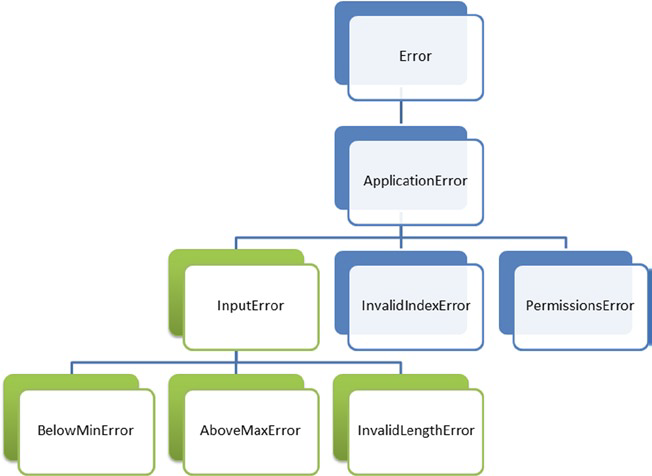
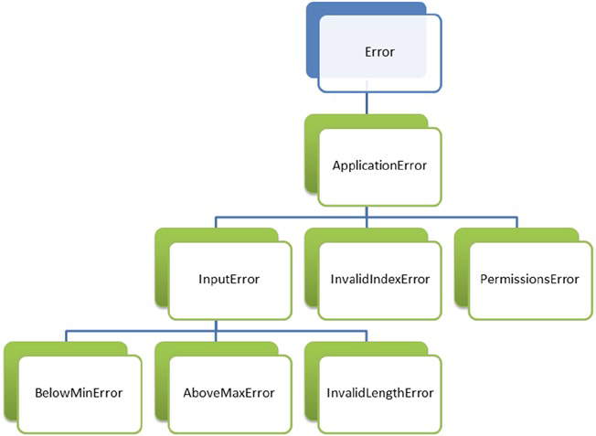
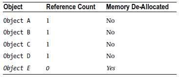
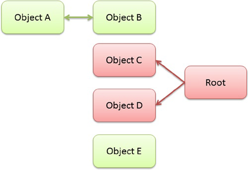

# Chapter 7 Exceptions, Memory, and Performance

- 예외(Exception) 및 메모리 관리(MM : Memory Management)를 잘 알면 프로그램 작성에 도움이 됨
- TypeScript, JavaScript의 예외가 C#, Java, PHP 등 다른 언어를 다뤄본 개발자들에게는 친숙해 보이겠지만, 미묘한 차이가 있음
- 7장에서 MM 과 GC(Garbage Collection) 의 최적화 테스트를 위한 측정 방법에 대해서 다룰 예정

## 1. 예외 (Exceptions)

- 예외는 프로그램이나 모듈이 계속해서 처리하는게 불가능함을 나타내기 위해 사용됨
- 하지만, Program Logic 상의 문제를 예외를 통해서 처리하는 경우가 종종 있는데, 이 경우에는 예외처리 없이 Logic으로 검증하는게 더욱 바람직함
- 예외에 대해서 별도의 처리를 해주지 않으면 JavaScript 콘솔에 표시됨. (콘솔에는 개발자가 별도의 출력을 할 수도 있음)

 - 최신 브라우저 들은 콘솔 기능을 모두 제공함
 - Windows, Linux는 `Ctrl + Shift + I` 또는 `F12` , Max은 `Cmd + Opt + I`를 누르면 개발자 도구, 브라우저 콘솔이 열림

### 1.1 예외 발생 (Throwing Exceptions)

- `throw` 키워드를 이용해서 예외를 발생시킴
- 예외로 어떤 타입의 객체라도 전달이 가능하지만, 가능하다면 `Error`객체에 메세지를 포함시키는 것이 바람직함

#####Listing 7-1. Using the throw keyword
```TypeScript
function errorsOnThree(input: number) {
    if (input === 3) {
        throw new Error('Three is not allowed');
    }

    return input;
}

var result = errorsOnThree(3);
```

`Error` 타입의 예외를 전달하는 예제인데, 사용자 정의 예외를 직접 구현하는 것도 가능합니다.
`toString()` 메서드를 구현해주면 콘솔에 출력되는 정보를 보기 좋게 할 수 있습니다.

#####Listing 7-2. Custom error
```TypeScript
class ApplicationError implements Error {

    public name = 'ApplicationError';

    constructor(public message: string) {
        if (typeof console !== 'undefined') {
            console.log('Creating ' + this.name + ' "' + message + '"');
        }
    }

    toString() {
        return this.name + ': ' + this.message;
    }
}
```

- `InputError` 는 `ApplicationError`를 상속받아서 아무런 구현도 하지 않음
- `errorsOnThree` 함수에서 잘못된 입력에 대해서 `InputError`를 발생

#####Listing 7-3. Using inheritance to create special exception types
```TypeScript
class ApplicationError implements Error {

    public name = 'ApplicationError';

    constructor(public message: string) {
    }

    toString() {
        return this.name + ': ' + this.message;
    }
}

class InputError extends ApplicationError {
}

function errorsOnThree(input: number) {
    if (input === 3) {
        throw new InputError('Three is not allowed');
    }
    return input;
}
```

- `ApplicationError`를 사용하지 않고 `Error`를 바로 발생시켜도 되지만, 우리가 작성한 코드에서의 오류를 모두 `ApplicationError` 또는 이것을 상속받은 오류만 발생시킬 경우 우리가 작성한 코드 이외의 곳에서 발생한 오류와 구분이 쉬워짐

### 1.2 예외 처리 (Exception Handling)

- 예외발생시 별도의 처리를 하지 않으면 프로그램이 종료됨
- 예외를 처리하기 위해서는 예외가 발생한 곳을 `try-catch-finally` 블록으로 감싸줘야 함

#####Listing 7-4. Unconditional catch block
```TypeScript
try {
    var result = errorsOnThree(3);
} catch (err) {
    console.log('Error caught, no action taken');
}
```

위 예제는 모든 종류의 예외에 대해서 처리를 하는 코드인데, 이런식의 처리는 좋은 방법이 아닙니다.
우리가 예상가능하고 처리가능한 예외에 대해서만 처리를 하고 나머지 예외에 대해서는 다시 발생시키는 것이 더 올바른 방법입니다.

#####Listing 7-5. Checking the type of error
```TypeScript
try {
    var result = errorsOnThree(3);
} catch (err) {
    if (!(err instanceof ApplicationError)) {
        throw err;
    }

    console.log('Error caught, no action taken');
}
```

위 예제는 `ApplicationError`와 이 것을 상속받은 오류에 대해서만 처리를 하고 나머지에 대해서는 처리를 하지 않는 코드입니다.

#####Figure 7-1. Error class hierarchy


`ApplicationError` 대신 `InputError`에 대해서 처리하도록 했다면, 아래 그림과 같이 `InputError`, `BelowMinError`, `AboveMaxError`, `InvalidLengthError`에 대해서는 처리를 해주지만, 나머지에 대해서는 처리를 하지 않고 Call Stack에 오류를 전달하게 됩니다.

#####Figure 7-2. Handling InputError exceptions


`ApplicationError`에 대해서는 아래 7가지 오류에 대해서 처리를 해줍니다.

#####Figure 7-3. Handling ApplicationError exceptions


로우레벨 관련 코드를 작업하는 경우에는 예외의 타입을 정확하게 분류하여 작업을 할 필요가 있지만, UI 작업과 같은 경우에는 좀더 일반적인 예외 종류에 대해서 처리를 하여도 무방합니다.
예외는 성능 비용이 큰 편에 속하기 때문에 단순히 루프를 빠져나가기 위한 신호 같은 용도로 사용하는 것은 적절하지 않습니다.

## 2. 메모리 (Memory)

TypeScript 같은 고차원 언어에서는 메모리 관리가 자동으로 됩니다.
우리가 생성한 변수나 객체의 경우 범위를 넘어서 사용된다던지, 댕글링 포인트(dangling pointer)가 되지 않습니다.
대부분의 메모리 관련 오류는 자동으로 처리되지만 `Out of Memory`같이 처리가 되지 않는 오류도 있습니다.
이번 장에서는 어떻게 하면 그런 오류들을 피할 수 있을 것인지에 대해서 다뤄볼 예정입니다.

### 2.1 자원 해제 (Releasing Resources)

타입스크립트에서는 관리되지 않는 자원을 사용할 경우가 있습니다.
대부분의 API들은 작업이 완료되었을 경우 인자가 전달되는 비동기 패턴으로 되어 있습니다.
센서에 가까이 있을 때 검출되는 API에 대한 사용 예제를 보도록 하겠습니다.

#####Listing 7-6. Asynchronous pattern
```TypeScript
var sensorChange = function (reading) {
    var proximity = reading.near ?
        'Near' : 'Far';

    alert(proximity);
}

window.addEventListener('userproximity', sensorChange, true);
```

비동기 패턴을 통해 근접 센서로부터 정보를 얻어 올수 있지만, 통신 채널을 통한 응답을 보장해 주지는 못합니다.
오류가 발생할 경우에 대해서 대비하기 위해서 `try-finally` 블록을 이용해야 합니다.

#####Listing 7-7. Imaginary unmanaged proximity sensor
```TypeScript
var sensorChange = function (reading) {
    var proximity = reading.near ?
        'Near' : 'Far';

    alert(proximity);
}

var readProximity = function () {
    var sensor = new ProximitySensor();

    try {
        sensor.open();
        var reading = sensor.read();
        sensorChange(reading);
    } finally {
        sensor.close();
    }
}

window.setInterval(readProximity, 500);
```

`finally` 블록을 통해서 sensor의 `open`, `read`, `sensorChange` 중 어디에서 오류가 발생하더라도 `close`가 호출되는 것을 보장해 주게 됩니다.

### 2.2 가비지 콜렉션 (Garbage Collection)

메모리가 더 이상 사용되지 않을 경우 GC를 통해서 해제되게 됩니다.
예전 방식의 브라우저의 경우 참조 카운트(Reference Count)가 0이 되었을 경우 해제를 하게 되는데,
만약 2개의 객체가 서로 참조하는 경우에는 RC가 0이 되지 않아서 해제되지 않게 됩니다.

#####Table 7-1. Reference counting garbage collection


최신의 브라우저의 경우에는 루트에 도달 가능한 모든 객체를 찾아낸 뒤, 나머지 객체에 대해서 마크앤스윕(mark-and-sweep) 알고리즘을 이용해서 해결합니다.
GC 수행 시간은 더 걸릴 수 있지만, 메모리 누수의 발생 가능성을 줄여 줍니다.

#####Figure 7-4. Mark and sweep


`Table 7-1`과 `Figure 7-4`가 동일한 객체일 경우 RC를 사용하는 경우라면 `E`에 대해서만 해제를 하지만, MAS를 사용하는 경우라면 서로 참조하고 있는 `A`,`B`에 대해서도 해제가 가능합니다.

### 2.3 성능 (Performance)

p.170 하단 할 차례
