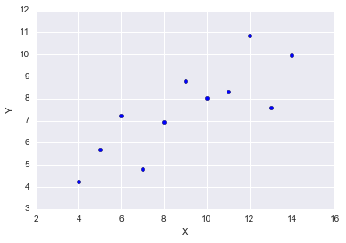
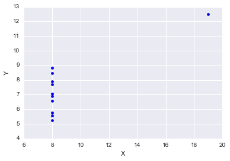
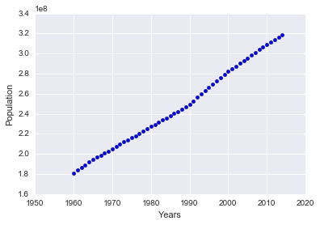

# 파이썬으로 풀어보는 수학

- 원서명 : Doing Math with Python: Use Programming to Explore Algebra, Statistics, Calculus, and More! (ISBN 9781593276409)
- 지은이 : 아미트 사하(Amit Saha)
- 원서 및 관련자료 : <https://www.nostarch.com/doingmathwithpython>
- 번역서 : <http://www.acornpub.co.kr/book/doing-math-with-python>


## 3장 통계값을 이용한 데이터 설명

### 1. 평균(mean)

숫자 집합을 요약하는 가장 일반적이고 집합적인 방법입니다.
모든 숫자들의 합을 그 갯수로 나눈 값입니다.


```python
donations = [100, 60, 70, 900, 100, 200, 500, 500, 503, 600, 1000, 1200]

def calculate_mean(numbers):
    return sum(numbers) / len(numbers)

calculate_mean(donations)
```


    477.75


### 2. 중위수(median)

숫자 집합에서 중간에 있는 값입니다.
만약 짝수개의 숫자가 있는 경우에는 가운데 두 수의 평균값을 계산합니다.


```python
def calculate_median(numbers):
    numbers.sort()
    n = len(numbers)
    i = int(n/2)

    if n % 2 == 0:
        return (numbers[i -1] + numbers[i]) / 2
    else:
        return numbers[i]

calculate_median(donations)  
```


    500.0


### 3. 최빈수(mode)

최빈값이란 가장 자주 발생한 수를 뜻합니다.
`Counter`클래스를 이용하면 쉽게 가능합니다.


```python
scores = [ 7, 8, 9, 3, 10, 9, 9, 9, 9, 4, 5, 6, 1, 5, 6, 7, 8, 6, 1, 10]

from collections import Counter
c = Counter(scores)
c
```


    Counter({1: 2, 3: 1, 4: 1, 5: 2, 6: 3, 7: 2, 8: 2, 9: 5, 10: 2})


그 결과로 `element : 갯수`를 저장한 `Dictionary`를 리턴합니다.
`.most_common(갯수)`를 사용해서 가장 빈도가 높은 요소만을 추출할 수도 있습니다.


```python
c.most_common(1)
```


    [(9, 5)]


이것을 이용하여 최빈수를 구하는 메서드를 만들어 보겠습니다.
최빈수는 여러개가 될 수 있으므로 최대 빈도 횟수를 구한 뒤 같은 것을 모두 리턴해야 합니다.


```python
def calculate_mode(numbers):
    result = []
    c = Counter(numbers).most_common()
    most = c[0][1]
    
    for e, n in c:
        if n == most:
            result.append(e)
    
    return result
    

calculate_mode(scores)
```


    [9]


### 4. 빈도 테이블 생성

전체 숫자에 대한 빈도를 출력하는 테이블을 생성해 보겠습니다.


```python
def frequency_table(numbers):
    for e, n in Counter(numbers).most_common():
        print (e,'\t', n)

frequency_table(scores)
```

    9 	 5
    6 	 3
    1 	 2
    5 	 2
    7 	 2
    8 	 2
    10 	 2
    3 	 1
    4 	 1


출력순서는 빈도수가 아닌 항목의 순서대로 하고 싶다면 아래와 같이 정렬을 해주면 됩니다.


```python
def frequency_table(numbers):
    c = Counter(numbers).most_common()
    s = sorted(c, key=lambda i : i[0], reverse=False)
    for e, n in s:
        print (e,'\t', n)

frequency_table(scores)
```

    1 	 2
    3 	 1
    4 	 1
    5 	 2
    6 	 3
    7 	 2
    8 	 2
    9 	 5
    10 	 2


### 5. 산포정도 측정

#### 5.1 범위(range), 최소(min), 최대(max) 구하기

값들의 최소값과 최대값 간의 거리가 얼마나 되는지를 보여줍니다.


```python
def find_range(numbers):
    lowest = min(numbers)
    highest = max(numbers)
    return highest - lowest, lowest, highest

find_range(donations)
```


    (1140, 60, 1200)


#### 5.2 분산(variance)과 표준편차(standard deviation)

값들이 평균값 주변에 모여있는지 아니면 흩어져 있는지 정도를 알려주는 수치입니다.

분산은 평균값과의 차이를 제곱한 값들의 평균입니다.


```python
def calculate_variance(numbers):
    mean = calculate_mean(numbers)
    diffSquare = 0
    for n in numbers:
        diffSquare += (n - mean)**2
    return diffSquare/(len(numbers) - 1)

calculate_variance(donations)
```


    153869.8409090909


표준편차는 분산의 제곱근 값입니다.

값이 0에 가까워질수록 평균에 가까운 값들이 모여 있다는 뜻이고, 값이 커질수록 평균값과 멀게 분산되어 있는 값들이 많다는 뜻입니다.


```python
def calculate_stddev(numbers):
    return calculate_variance(numbers)**0.5

calculate_stddev(donations)
```


    392.26246431323364


### 6. 두 데이터 집합 간 상관관계 계산

두 숫자 집한 간 관계의 특성과 강도를 알려주는 측정값(`피어슨 상관계수`)를 측정하는 방법에 대해서 알아보겠습니다.
이 값은 선형 관계의 강도를 측정한 값으로 **-1 에서 1** 사이의 값을 가집니다.
값이 **0** 이면 전혀 선형 관계가 없다는 것을 의미하며, **1이거나 1에 가까울수록** 강한 양의 선형관계가 있음을 의미하며, **-1이거나 -1에 가까우면** 강함 음의 상관관계가 있음을 의미합니다.


상관관계 계산을 좀 더 편리하게 하기 위해 `zip()` 메서드에 대해서 잠깐 소개하겠습니다.
`zip()`은 입력된 2개의 `List`의 각 항목에 해당하는 쌍(pair)을 리턴해 줍니다.
만약 두 `List`의 길이가 다를 경우 길이가 작은 `List`의 모든 요소를 다 읽었을 때 종료됩니다.


```python
s1 = [ 1, 2, 3, 4]
s2 = [ 5, 6, 7 ]
for x in zip(s1, s2):
    print(x)
```

    (1, 5)
    (2, 6)
    (3, 7)


이제 상관계수를 계산하는 메서드를 작성해 보겠습니다.


```python
def find_corr(x, y):
    n = min(len(x), len(y))
    
    sumXY = 0
    sumX = 0
    sumY = 0
    sumXsq = 0
    sumYsq = 0
    
    for xn, yn in zip(x, y):
        sumXY += xn * yn
        sumX += xn
        sumY += yn
        sumXsq += xn*xn
        sumYsq += yn*yn
    
    return (n * sumXY - sumX * sumY) / ((n * sumXsq - sumX ** 2) * (n * sumYsq - sumY ** 2)) ** 0.5
        
find_corr(s1,s2)
```


    1.0


```python
s3 = [10, 9, 8, 7]
find_corr(s1,s3)
```


    -1.0


```python
s4 = [5, 8, 6, 9]
find_corr(s1,s4)
```


    0.7071067811865475


### 7. 데이터 간의 상관관계 여부 확인

2개의 데이터가 관계가 있는지 없는지 여부를 확인하려면 산점도를 그려서 살펴보면 편합니다.
예를 들어서 고등학교 성적 등급 과 대학입학시험 성적 사이에 관계가 있는지 없는지 여부에 대해서 알아보고자 합니다.
먼저 두 데이터 간의 산점도를 그려보겠습니다.


```python
%matplotlib inline
```


```python
scoreOfHighSchool  = [ 90, 92, 95, 96, 87, 87, 90, 95, 98, 96 ]
scoreOfCollegeTest = [ 85, 87, 86, 97, 96, 88, 89, 98, 98, 87 ]

import matplotlib.pyplot as plt
import seaborn
def draw_scatter_plot(x, y, xText, yText):
    plt.scatter(x,y)
    plt.xlabel(xText)
    plt.ylabel(yText)
    plt.show()

draw_scatter_plot(scoreOfHighSchool, scoreOfCollegeTest, 'Score of High School', 'Score Of College Test')
```


**산점도**를 보니 고등학교 성적과 대학입학 성적 사이에 큰 상관이 없는 것을 알 수 있습니다.


```python
find_corr(scoreOfHighSchool, scoreOfCollegeTest)
```


    0.3183785775683751


**상관계수**를 구해보니 약 0.32 정도가 나옵니다.

그럼 이제 전체성적이 아닌 고등학교 수학성적만을 대학입학성적과 비교해 보도록 하겠습니다.


```python
scoreOfMath = [ 83, 85, 84, 96, 94, 86, 87, 97, 97, 85 ]

draw_scatter_plot(scoreOfMath, scoreOfCollegeTest, 'Score of Math in High School', 'Score Of College Test')
```


**산점도**를 보니 거의 직선에 가깝게 보입니다.


```python
find_corr(scoreOfMath, scoreOfCollegeTest)
```


    0.9989633063220916


**상관계수**도 거의 1에 가까운 숫자로 나옵니다.
고로 **산점도**와 **상관계수**를 이용해 실제로 고등학교 수학 점수와 대학입학 시험 점수 사이에는 강한 상관관계가 존재한다는 결론을 내릴 수 있습니다.

### 8. 산점도의 중요성

앞서 많은 통계데이터를 구하는 메서드들을 작성하였습니다.
통계데이터가 전체데이터를 대표하는 값이긴 하지만, 이것이 모든 것을 다 대변해주는 값은 아닙니다.

프란시스 안스콤(Francis Anscombe)가 작성한 `Graphs in Statistical Analysis`를 한 번 살펴 보도록 하겠습니다.
안스콤의 콰르텟(Anscombe quartet)이라는 4개의 데이터를 살펴보겠습니다.


```python
AX = [ 10.0,  8.0, 13.0,  9.0, 11.0, 14.0,  6.0,  4.0, 12.0,  7.0,  5.0 ]
AY = [ 8.04, 6.95, 7.58, 8.81, 8.33, 9.96, 7.24, 4.26, 10.84, 4.82, 5.68]

BX = AX
BY = [ 9.14, 8.14, 8.74, 8.77, 9.26, 8.1, 6.13, 3.1,9.13, 7.26, 4.74 ]

CX = AX
CY = [ 7.46, 6.77, 12.74, 7.11, 7.81, 8.84, 6.08, 5.39, 8.15, 6.42, 5.73 ]

DX = [ 8.0, 8.0, 8.0, 8.0, 8.0, 8.0, 8.0, 19.0, 8.0, 8.0, 8.0]
DY = [ 6.58, 5.76, 7.71, 8.84, 8.47, 7.04, 5.25, 12.5, 5.56, 7.91, 6.89 ]
```

위 4개 데이터셋의 X, Y 각각에 대한 평균, 표준편차와 X-Y의 상관관계에 대해서 살펴보겠습니다.


```python
aStat = [ calculate_mean(AX), calculate_stddev(AX), calculate_mean(AY), calculate_stddev(AY), find_corr(AX, AY) ]
bStat = [ calculate_mean(BX), calculate_stddev(BX), calculate_mean(BY), calculate_stddev(BY), find_corr(BX, BY) ]
cStat = [ calculate_mean(CX), calculate_stddev(CX), calculate_mean(CY), calculate_stddev(CY), find_corr(CX, CY) ]
dStat = [ calculate_mean(DX), calculate_stddev(DX), calculate_mean(DY), calculate_stddev(DY), find_corr(DX, DY) ]
sTitle = ['X Mean', 'X StdDev', 'Y Mean', 'Y StdDev', 'X-Y corr']

for i in range(0,5):
    print(sTitle[i],'\t',aStat[i],'\t',bStat[i],'\t',cStat[i],'\t',dStat[i])
```

    X Mean 	 9.0 	 9.0 	 9.0 	 9.0
    X StdDev 	 3.3166247903554 	 3.3166247903554 	 3.3166247903554 	 3.3166247903554
    Y Mean 	 7.500909090909093 	 7.500909090909091 	 7.500000000000001 	 7.50090909090909
    Y StdDev 	 2.031568135925815 	 2.0316567355016177 	 2.030423601123667 	 2.0305785113876023
    X-Y corr 	 0.816420516344843 	 0.8162365060002422 	 0.8162867394895953 	 0.8165214368885068


거의 수치가 똑같이 나온것을 확인할 수 있습니다.
그럼 이제 각각에 대한 산점도를 보도록 하겠습니다.


```python
draw_scatter_plot(AX, AY,'X','Y')
draw_scatter_plot(BX, BY,'X','Y')
draw_scatter_plot(CX, CY,'X','Y')
draw_scatter_plot(DX, DY,'X','Y')
```








위 4개의 산점도를 보면 모두 다른 데이터 임을 알 수 있습니다.
따라서 데이터를 분석하는 데 산점도는 중요한 도구가 될 수 있으며, 결과를 도출하기 전에 한번 쯤 살펴봐야 할 필요성은 있어 보입니다.

### 9. 파일에서 데이터 읽기

#### 9.1 텍스트 파일에서 데이터 읽기

다음 내용의 ch03.mydata.txt 를 읽는 예제 코드를 보도록 하겠습니다.
```
100
60
70
900
100
200
500
500
503
600
1000
1200
```


```python
def txt_to_list(filename):
    data = []
    with open(filename) as f:
        for line in f:
            data.append(float(line))
    return data

txt_to_list('files/ch03.mydata.txt')
```

    [100.0, 60.0, 70.0, 900.0, 100.0, 200.0, 500.0, 500.0, 503.0, 600.0, 1000.0, 1200.0]


#### 9.2 CSV 파일에서 데이터 읽기

콤마구분값(csv) 파일은 엑셀에서 편집이 가능하기 때문에 많이 사용됩니다.
다음 내용의 ch03.data.csv 파일을 읽는 예제를 보도록 하겠습니다.
```
Number,Square
10,100
9,81
22,484
```


```python
import csv

def csv_to_list(filename, colHeaderLen, rowHeaderLen):
    reader = csv.reader(open(filename))                    
    columns = len(next(reader)) # pass column header
    
    for i in range(1, colHeaderLen):
        next(reader)
        
    data = []
    
    for i in range(rowHeaderLen, columns):
        data.append([])
    
    for row in reader:
        for i in range(rowHeaderLen, columns):
            data[i - rowHeaderLen].append(float(row[i]))
            
    return data

csv_to_list('files/ch03.data.csv', 1, 0)
```


    [[10.0, 9.0, 22.0], [100.0, 81.0, 484.0]]


## 프로그래밍 연습

### 1. 다른 csv 데이터로 테스트

<https://www.quandl.com/data/WORLDBANK/USA_SP_POP_TOTL> 에서 `csv` 파일을 다운로드 합니다.  
이 데이터는 1960년부터 2012년 동안 매년말 미국의 총 인구수 입니다.  
이 데이터를 이용해서 이번 챕터에서 배운 통계 데이터 및 그래프를 출력하세요.


```python
data = csv_to_list('files/WORLDBANK-USA_SP_POP_TOTL.csv', 1, 1)
print('Mean : ', calculate_mean(data[0]))
print('Median : ', calculate_median(data[0]))
print('StdDev : ', calculate_stddev(data[0]))

years = [i + 1960 for i in range(0, len(data[0]))]
draw_scatter_plot(years, data[0],'Years','Population')
```

    Mean :  247353970.12727273
    Median :  242289000.0
    StdDev :  41223553.97342924





### 2. 퍼센트 위치 계산

`백분위수`란 관측값에 대해서 설정한 백분율 이하의 값들을 의미합니다.
예를 들어 95분위수라는 말은 집합내에서 해당 수보다 낮은 수들이 95%가 있다는 것을 의미합니다.

`백분위수 p`로 관측값을 계산하는 방법은 다음과 같습니다.

1. 오름차순으로 data를 정렬
2. `i = (n * p / 100) + 0.5`를 계산 (n은 data 내의 아이템 개수)
3. i가 정수이면 data[i]가 백분위 p에 대항하는 숫자
4. i가 정수가 아니면 k가 i의 정수부분이고, f가 i의 분수 부분으로 계산해서 `(1-f) * data[k] + f * data[k+1]`이 백분위 p에 해당하는 숫자

파일 내의 숫자 집합을 취해서 입력된 백분위에 해당하는 숫자를 표시하는 프로그램을 작성하세요.


```python
data = csv_to_list('files/ch03.math.score.csv', 1, 0)

def find_percentile_rank(data, p):
    data.sort()
    n = len(data)
    i = n * p / 100 + 0.5
    k = int(i)

    if (i.is_integer()):
        return data[k]
    
    f = i - k
    return (1-f)*data[k] + f*data[k+1]

p = float(input('Enter percentile : '))
print(find_percentile_rank(data[0], p))
```

    Enter percentile : 95
    98.5


### 3. 그룹화한 빈도 테이블 생성

그룹화한 빈도 테이블이란 주어진 데이터를 분류화하여 해당 분류안에 몇개의 데이터가 있는지를 표시해 주는 테이블 입니다.
여기서 분류를 생성하는 방법에는 여러 가지가 있을 수 있습니다.


```python
def create_classes(numbers, n):
    width, low, high = find_range(numbers)
    width /= n
    classes = []
    a = low
    b = low + width
    while a < high - width :
        classes.append((a,b))
        a = b
        b = a + width
    classes.append((a, high + 1))
    return classes

print(scores)
create_classes(scores, 4)
```

    [1, 1, 3, 4, 5, 5, 6, 6, 6, 7, 7, 8, 8, 9, 9, 9, 9, 9, 10, 10]


    [(1, 3.25), (3.25, 5.5), (5.5, 7.75), (7.75, 11)]


위에서 제공하는 `create_classes()` 메서드를 사용해서 그룹화한 빈도 테이블을 구현하세요.


```python
from collections import defaultdict

def grouping_frequency_table(numbers, n):
    classes = create_classes(numbers, n)
    numbers.sort()
    i = 0
    table = defaultdict(int)
    for n in numbers:
        if n >= classes[i][1]:
            i += 1
        table[classes[i]] += 1
    return table

grouping_frequency_table(scores, 4)
```


    defaultdict(int, {(1, 3.25): 3, (3.25, 5.5): 3, (5.5, 7.75): 5, (7.75, 11): 9})


